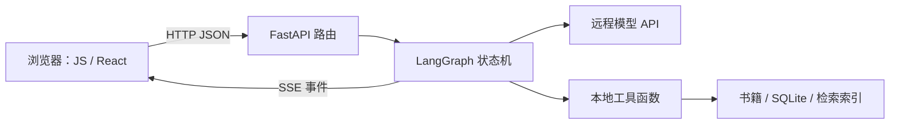

# 第 00 章：建立学习地图，把环境变成可检查的东西

## 本章完成后

你能说明浏览器、Python 服务、模型服务和数据文件分别在哪里运行；能启动实验项目；遇到错误能说出“哪个进程、哪个端口、哪个解释器”。

## 0.1 用你已知的概念理解新系统

C++ 程序通常从 `main()` 开始，你能顺着调用栈找函数。Web 应用没有一条永远延续的调用栈：浏览器发请求，服务器处理请求，结果跨网络返回。模型服务又是另一个远程进程。调试时必须靠请求编号把几段日志连起来。

Java 的 Spring Controller 可以类比 FastAPI 路由；DTO 类比 Pydantic 模型；Service 类比我们的检索和 Agent 引擎。类比只能帮助入门：Python 的类型注解默认不在所有调用处强制验证，`async` 也不等于创建线程。



不要先安装整套生产服务。课程项目只需要 Python 3.12、Node.js 和一个浏览器。Node 主要用来运行 JS 练习、测试及 React 构建；原生 JS 版本由 Python 直接提供页面。

## 0.2 先理解三个目录

仓库根目录是 `DeepPhilosophy/`。教程在 `docs/course/`。实验项目根目录是 `examples/phiagent-lab/`。下面提到“项目根目录”均指最后一个，而不是生产仓库根目录。

macOS / Linux，在终端执行：

```bash
cd /Users/sen/DeepPhilosophy/examples/phiagent-lab
python3.12 --version
node --version
python3.12 -m venv .venv
source .venv/bin/activate
python -m pip install -r requirements.txt
python -c "import sys; print(sys.executable)"
```

如果 `python3.12` 不存在，先安装 Python 3.12；你机器的系统 `python3` 可能仍是 3.9。也可以用仓库已有的 `.venv/bin/python` 创建新的课程虚拟环境，但不要向生产环境随意升级依赖。

Windows PowerShell 的对应命令：

```powershell
cd 你的教程目录\project
py -3.12 -m venv .venv
.\.venv\Scripts\python.exe -m pip install -r requirements.txt
.\.venv\Scripts\python.exe -m uvicorn phiagent_lab.app:app --host 127.0.0.1 --port 8021
```

不必为执行激活脚本去修改全局策略，直接调用虚拟环境里的 Python 即可。

虚拟环境相当于这个项目独立的解释器和包目录。`python -m pip` 明确使用当前 Python 的包管理器，能避免“装了包却导入失败”的路径混乱。Node 的 `node_modules` 扮演相近但并不完全相同的依赖隔离角色。

## 0.3 第一次启动

在项目根目录、激活课程环境后：

```bash
python -m uvicorn phiagent_lab.app:app --host 127.0.0.1 --port 8021
```

浏览器打开 `http://127.0.0.1:8021`。输入“自由与责任有什么关系？”。默认 `PHI_MODE=mock`，不会请求远程模型，也不会消耗模型费用。它固定执行“搜索 → 读取 → 回答”，用来验证链路，不代表模型具备理解能力。

另开终端检查接口：

```bash
curl http://127.0.0.1:8021/api/health
```

预期包含 `{"ok":true,"mode":"mock"}`。打开 `/docs` 可以看到 FastAPI 的交互式 API 页面。终端按 Ctrl+C 关闭服务。

CLI 版本：

```bash
python -m phiagent_lab.cli
```

输入 `/quit` 退出。`-m` 的意思是按模块方式运行，Python 会按包规则处理导入。

## 0.4 为什么不一开始复制全部 PhiAgent

完整项目同时包含前端状态、模型协议、数据规范和部署差异。十个地方一起失败时，你无法知道是哪一处导致。实验项目让每层都有可替换边界；后半课程再按同样边界对接完整系统。最终验收仍然是完整能力矩阵，而不是离线演示。

## 0.5 练习与验收

1. 把端口改为 8022，解释为什么旧地址打不开。
2. 同时启动两次 8021，找到端口占用错误。
3. 在另一个未激活虚拟环境的终端运行导入，比较解释器路径。
4. 不启动网页，只用 CLI 完成一次检索。

验收：不用“它坏了”描述故障，而能给出命令、工作目录、报错和预期结果。保留这个格式，之后所有排错都用它。

<!-- NAV -->

[课程目录](../README.md) · [下一章](01-python-migration.md)
