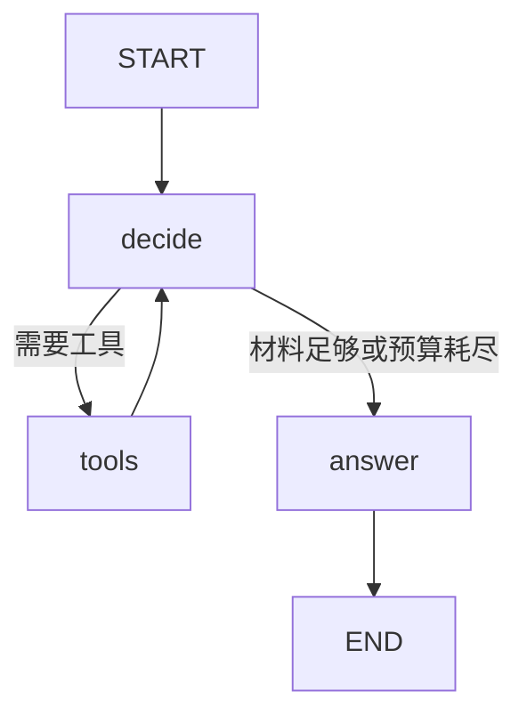

# 第 13 章：用 LangGraph 表达状态、分支和循环

## 13.1 把程序分成状态、节点、边

State 是一次运行共享的数据结构；节点读取状态并返回更新；边决定下一步执行哪个节点。你在 C++ 中写过有限状态机的话，这种分解会很自然。

课程图如下：



基础课程采用决策与最终流式回答分开，容易观察两个阶段，但会增加一次最终生成调用。完整 PhiAgent 的模型与工具循环未必采用同样划分。第 23 章会评测是否需要合并以降低延迟。

## 13.2 为什么需要 reducer

局部片段：

```python
from typing import Annotated, TypedDict
import operator

class State(TypedDict):
    messages: Annotated[list[dict], operator.add]
    rounds: int
```

默认状态更新覆盖旧值；messages 使用 operator.add 将新列表接到旧列表后。因此节点只返回新增消息，不能每次返回“旧历史 + 新消息”，否则旧历史会重复。

LangChain 消息对象常配合 add_messages，它还能处理消息 id 等语义。课程使用普通协议字典和简单追加 reducer，便于看清 HTTP 消息结构。两种设计不要混着用而不理解差异。

## 13.3 条件边与 compile

```python
graph.add_conditional_edges(
    "decide", lambda state: "answer" if state["ready"] else "tools"
)
```

路由函数返回节点名。节点函数负责更新，路由负责选择后续路径。compile 后得到可执行图；ainvoke 获取最终状态，astream 获取运行中的事件。

课程固定 LangGraph 版本并显式使用流输出 v2。`stream_mode="custom"` 接收节点通过 get_stream_writer 发出的应用事件，能复用任意模型客户端。升级版本时需检查返回事件结构，不要直接照搬旧博客。

## 13.4 图的步数不是工具预算

decide 和 tools 各自算执行步骤。四轮工具循环可能消耗多于四步。recursion_limit 是意外循环兜底，不应承担全部业务预算。还要有总时长、工具调用数、token 和成本约束。

生产图中应尽可能让节点小而可观察：检索、执行、生成、校验分别记录结果。图越复杂不代表系统越智能；每增加一个节点都应解释它提供了什么可验证能力。

## 13.5 Checkpoint 与会话历史

Checkpoint 用于保存图在某个步骤的状态，支持恢复或中断继续。聊天历史用于产品记录，两者用途不同。保存历史不等于支持从执行到一半的工具节点继续。

如果使用 checkpointer，线程标识必须与用户和会话授权绑定；不能允许用户任意指定别人的 thread_id。内存 checkpointer 重启后丢失，数据库型实现还需要考虑并发写入、版本迁移和清理。

恢复有副作用的节点可能重复执行。设计幂等工具或把“准备”和“确认执行”分开；不要因为框架支持恢复就认为支付、发信等动作天然安全重试。

## 13.6 练习

在课程图中添加一个 `validate` 节点，把引用校验从 answer 中分离。最多允许一次修复，再失败就明确返回错误。你需要新增 repair_count，并说明流式显示的初稿何时会被替换。

再把手写循环与图版本跑在同一 MockModel 上，对比工具执行序列。它们应完成相同任务。参考：[LangGraph 快速入门](https://docs.langchain.com/oss/python/langgraph/quickstart)、[流式事件](https://docs.langchain.com/oss/python/langgraph/streaming)、[持久化](https://docs.langchain.com/oss/python/langgraph/persistence)。

<!-- NAV -->

[课程目录](../README.md) · [上一章](12-manual-agent-loop.md) · [下一章](14-rag-retrieval.md)
